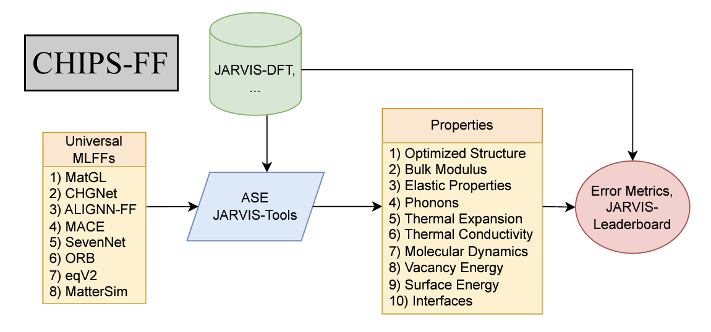

# CHIPS-FF



Benchmark machine-learning force fields (MLFFs) against JARVIS-DFT with **one
command**. CHIPS-FF relaxes structures and computes lattice constants, formation
& elastic properties, bulk modulus, surfaces, vacancies, phonons, interfaces
(work of adhesion), amorphous/MD, and thermal conductivity — then reports the
MAE vs DFT. It works across many potentials (`alignn_ff`, `chgnet`, `mace`,
`matgl`/M3GNet, `uma`, `sevenn`, `orb`, …) via ASE + JARVIS-Tools.

## Install

```bash
git clone https://github.com/atomgptlab/chipsff && cd chipsff
conda env create -f environment.yml -n chipsff && conda activate chipsff
pip install -e .
```
`run_main.py` auto-installs the chosen model's package and any analysis backend
(`elastic`, `phonopy`, `phono3py`, `intermat`, `matbench_discovery`) on first use,
so a minimal env is enough to start.

## Quickstart

```bash
python -m chipsff.run_main --alignn_ff        # full benchmark, default MATPES-r2SCAN
python -m chipsff.run_main --uma              # or --matgl / --chgnet / --mace
python -m chipsff.run_main --alignn_ff --model_path /path/to/model_dir   # your checkpoint
python -m chipsff.run_main --alignn_ff --n 5  # quick 5-material smoke test
```

**Any force field, no chipsff code needed.** If your model ships an ASE
calculator, point `--ase-calc` at it (a `module:callable_or_Class` spec):
```bash
python -m chipsff.run_main --ase-calc "mace.calculators:mace_mp" --optimize_only
python -m chipsff.run_main --ase-calc "orb_models.forcefield.calculator:ORBCalculator" \
    --calc-kwargs '{"device":"cpu"}' --tasks elastic
```
Output: a printed MAE table + `chipsff_table_<tag>.csv`, with per-material files
under `chipsff_frechet_<tag>/`. Chemical potentials are made **self-consistent**
with the selected model automatically (no stale-chempot correction needed).

## Run only the tasks you want (cheap → expensive)

Tasks are ordered from least to most expensive; each maps to a benchmark column.
Select a subset instead of the full run:

| Task | Column(s) | Flag example |
|------|-----------|--------------|
| `optimize` | lattice a, c · Kv · Ef | `--optimize_only` |
| `forces` | force error | `--tasks forces` |
| `elastic` | C11, C44 | `--tasks elastic` |
| `phonon` | ω_ph | `--tasks phonon` |
| `expansion` | thermal expansion (QHA) | `--tasks expansion` |
| `surface` | surface energy | `--tasks surface` |
| `vacancy` | vacancy formation | `--tasks vacancy` |
| `interface` | work of adhesion | `--tasks interface` |
| `amorphous` | melt–quench + RDF | `--tasks amorphous` |
| `kappa` | thermal conductivity | `--tasks kappa` |
| `sfe` | stacking-fault energy (FCC metals) | `--tasks sfe` |
| `voltage` | battery cathode voltage | `--tasks voltage` |
| `neb` | vacancy migration barrier | `--tasks neb` |
| `diffusion` | Li tracer diffusivity | `--tasks diffusion` |
| `wbm` | WBM / Matbench-Discovery relax + score | `--tasks wbm` |

```bash
python -m chipsff.run_main --alignn_ff --optimize_only        # a, c, Kv, Ef only
python -m chipsff.run_main --uma       --tasks elastic,phonon # a couple of tasks
python -m chipsff.run_main --chgnet    --up_to elastic        # everything up to elastic
python -m chipsff.run_main --alignn_ff                        # no flag = full benchmark
```

Handy switches:

| Flag | Effect |
|------|--------|
| `--optimize_only` | shortcut for `--tasks optimize` |
| `--tasks a,b,c` | run an explicit subset |
| `--up_to STAGE` | cumulative: all tasks up to and including `STAGE` |
| `--no_relax` | compute on the input (DFT) geometry, skip relaxation |
| `--all-materials` | vacancy/surface for all 104 (default: only the DFT-reference set that enters the MAE) |
| `--skip-interfaces` | drop the work-of-adhesion step |
| `--n N` | first N materials only (`0` = all 104) |
| `--device cpu` | force CPU |

The MAE table also reports a **`time_s`** column (mean wall-time per material),
so you get a timing benchmark alongside accuracy.

## Optional discovery / scaling tasks

```bash
python -m chipsff.run_main --alignn_ff --diatomics   # PES smoothness (tortuosity)
python -m chipsff.run_main --alignn_ff --scaling      # inference timing + peak memory
# WBM / Matbench-Discovery (shardable relax, then score):
SHARD=1 NSHARD=490 python -m chipsff.run_main --alignn_ff --wbm-relax \
    --wbm_zip /path/wbm-initial-atoms.extxyz.zip
python -m chipsff.run_main --alignn_ff --wbm-score \
    --leaderboard /path/jarvis_leaderboard/jarvis_leaderboard   # Ef MAE, F1, RMSD
```

## Combine models into the paper tables

```bash
python -m chipsff.run_main --alignn_ff --tag alignn_ff
python -m chipsff.run_main --matgl     --tag matgl
python -m chipsff.compile_tables      # scans cwd -> chipsff_table4_properties.{csv,md,tex} + scaling
```

## Examples (Colab)

- [Structure optimization & error comparison](https://colab.research.google.com/github/knc6/jarvis-tools-notebooks/blob/master/jarvis-tools-notebooks/chipsff_optimization.ipynb)
- [Scaling / timing](https://colab.research.google.com/github/knc6/jarvis-tools-notebooks/blob/master/jarvis-tools-notebooks/chipsff_scaling.ipynb)

<details>
<summary><b>Advanced: per-material analysis from a JSON config</b></summary>

For fine control over a single material or interface, drive the analyzer with a
config file:

```bash
python run_chipsff.py --input_file input.json
```

```json
{
  "jid": "JVASP-1002",
  "calculator_type": "chgnet",
  "chemical_potentials_file": "chemical_potentials.json",
  "use_conventional_cell": true,
  "properties_to_calculate": [
    "relax_structure", "calculate_ev_curve", "calculate_formation_energy",
    "calculate_elastic_tensor", "run_phonon_analysis", "analyze_surfaces",
    "analyze_defects", "run_phonon3_analysis", "general_melter", "calculate_rdf"
  ],
  "bulk_relaxation_settings": {
    "filter_type": "ExpCellFilter",
    "relaxation_settings": {"fmax": 0.05, "steps": 200, "constant_volume": false}
  },
  "phonon_settings":  {"dim": [2, 2, 2], "distance": 0.2},
  "surface_settings": {"indices_list": [[0,1,0],[0,0,1]], "layers": 4, "vacuum": 18},
  "defect_settings":  {"generate_settings": {"on_conventional_cell": true, "enforce_c_size": 8, "extend": 1}},
  "md_settings":      {"dt": 1, "temp0": 3500, "nsteps0": 1000, "temp1": 300, "nsteps1": 2000}
}
```

Interface run: set `"film_id"`, `"substrate_id"`, `"film_index"`,
`"substrate_index"` and `"properties_to_calculate": ["analyze_interfaces"]`.

**Analyzer methods**: `relax_structure`, `calculate_formation_energy`,
`calculate_ev_curve`, `calculate_elastic_tensor`, `run_phonon_analysis`,
`analyze_defects`, `analyze_surfaces`, `run_phonon3_analysis`,
`calculate_thermal_expansion`, `general_melter`, `calculate_rdf`,
`analyze_interfaces`.
</details>

<details>
<summary><b>Advanced: cluster (SLURM)</b></summary>

`chipsff/submit_slurm.sh` is an env-var-driven template
(`MODEL`, `TASK`, `NSHARD`, `DEVICE`, `EXTRA`, `LB`):

```bash
MODEL=alignn_ff sbatch chipsff/submit_slurm.sh                          # property table
MODEL=alignn_ff TASK=scaling DEVICE=cuda sbatch chipsff/submit_slurm.sh
MODEL=alignn_ff TASK=wbm NSHARD=490 EXTRA="--wbm_zip /path/wbm.zip" \
    sbatch --array=1-490%100 chipsff/submit_slurm.sh                    # WBM relax
```
</details>

## Contribute · Contact

Bugs/PRs welcome via [GitHub issues](https://github.com/atomgptlab/chipsff/issues);
contact daniel.wines@nist.gov or kamal.choudhary@nist.gov.
See the [contribution guide](https://github.com/atomgptlab/jarvis/blob/master/Contribution.rst)
and [code of conduct](https://github.com/atomgptlab/jarvis/blob/master/CODE_OF_CONDUCT.md).

## Funding

CHIPS Metrology Program, part of CHIPS for America, National Institute of
Standards and Technology, U.S. Department of Commerce.
